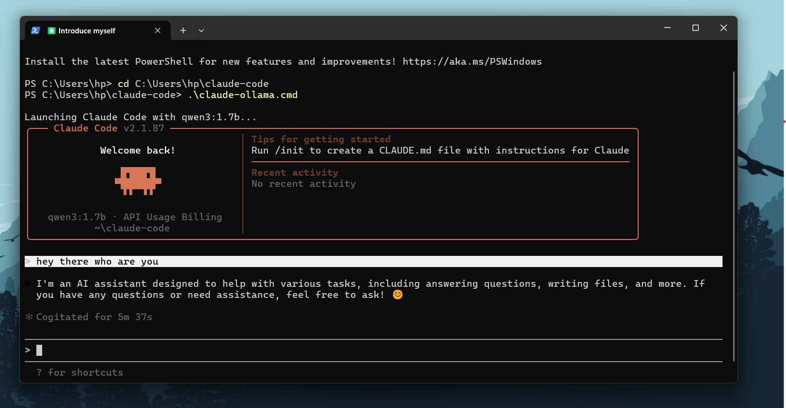

# Claude Code + Ollama Local Setup



This folder is set up to run Claude Code locally through Ollama.

It does not require an Anthropic API key.

## What is in this folder

- `claude-ollama.cmd`: Windows launcher for starting Claude Code with Ollama
- `src/`: Claude Code source files

## Current default model

The launcher currently uses:

```cmd
qwen3:1.7b
```

This was chosen because it is smaller than `qwen3.5:4b` and more likely to run on lower-end hardware.

## Requirements

- Windows
- Ollama installed and running
- Node.js and npm installed
- Claude Code CLI installed globally

## Install Claude Code CLI

```powershell
npm.cmd install -g @anthropic-ai/claude-code
```

## Pull the Ollama model

```powershell
ollama pull qwen3:1.7b
```

If you want a larger model later, you can try:

```powershell
ollama pull qwen3.5:4b
```

## Run Claude Code

From this folder:

```powershell
cd C:\Users\hp\claude-code
.\claude-ollama.cmd
```

## How the launcher works

The launcher uses Ollama's Claude Code integration:

```cmd
ollama launch claude --model qwen3:1.7b
```

If you pass extra arguments, they are forwarded to Claude Code.

Example:

```powershell
.\claude-ollama.cmd --help
```

## Changing the default model

Open `claude-ollama.cmd` and change this line:

```cmd
if "%CLAUDE_OLLAMA_MODEL%"=="" set "CLAUDE_OLLAMA_MODEL=qwen3:1.7b"
```

Examples:

```cmd
if "%CLAUDE_OLLAMA_MODEL%"=="" set "CLAUDE_OLLAMA_MODEL=qwen3.5:4b"
```

or

```cmd
if "%CLAUDE_OLLAMA_MODEL%"=="" set "CLAUDE_OLLAMA_MODEL=qwen3:4b"
```

## Important notes

- Regular Ollama chat can work even when Claude Code feels much slower.
- Claude Code sends a much larger prompt than a simple chat request.

## CPU-only fallback

If GPU mode crashes, force Ollama to CPU:

```powershell
setx CUDA_VISIBLE_DEVICES "-1"
```

Then:

1. Quit Ollama from the system tray.
2. Start Ollama again.
3. Open a new PowerShell window.
4. Run `.\claude-ollama.cmd`.

To re-enable GPU later:

```powershell
[Environment]::SetEnvironmentVariable("CUDA_VISIBLE_DEVICES", $null, "User")
```

Then restart Ollama.


## Troubleshooting

### Claude Code tries to connect to Anthropic

Use the launcher:

```powershell
.\claude-ollama.cmd
```

Do not run plain `claude` directly for this local setup.

### The model is too slow

Try a smaller model such as:

```powershell
ollama pull qwen3:1.7b
```

### Ollama crashes or returns 500 errors

Try CPU mode first:

```powershell
setx CUDA_VISIBLE_DEVICES "-1"
```

Then restart Ollama.

### Check what Ollama is doing

```powershell
ollama ps
```

## Commands used in this setup

```powershell
npm.cmd install -g @anthropic-ai/claude-code
ollama pull qwen3:1.7b
cd C:\Users\hp\claude-code
.\claude-ollama.cmd
```
#
